# Kickstarting with Excel

## Overview of Project

Previously, we were tasked with helping Louise analyze Kickstarter data to determine a set of factors that would increase the likelihood of success for a crowdfunding campaign to fund her play *Fever*. This analysis included things like which month to launch her crowdfunding campaign and what amount to set her goal at in order to maximize her chances of success.

### Purpose

Now, Louise has already launched her crowdfunding campaign, which came close to its goal but ultimately failed. Here, we will look at "how different campaigns [specifically, plays] fared in relation to their launch dates and their funding goals".

## Analysis and Challenges

### Analysis of Outcomes Based on Launch Date
A new column called "Years" was created, and the year() function was used to retrieve the year from the "Date Created Conversion" column:

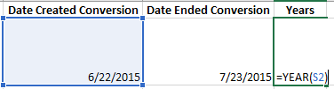

A pivot table was created in a new sheet called "Theater Outcomes by Launch Date" with the following parameters, and it was filtered to exclude "live":

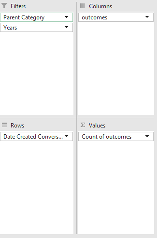 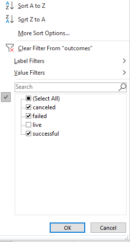

These settings resulted in a table matching the one in the instructions:

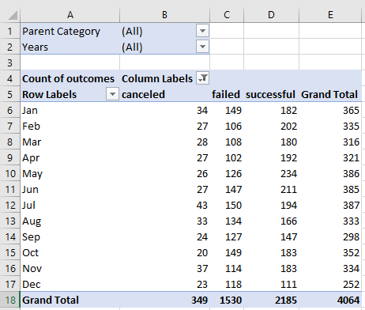

The "Parent Category" was filtered by "theater" and the outcomes sorted Z to A so that "successful" comes first:

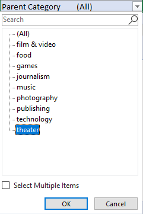 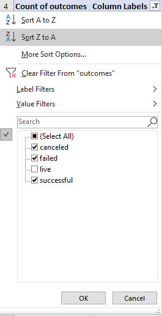

These settings resulted in a table matching the one in the instructions:

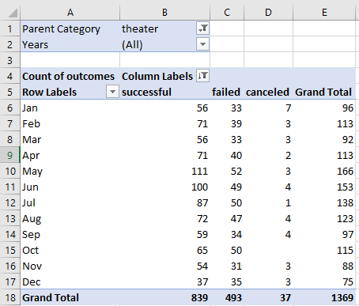

A chart was created showing the relationship between outcomes and launch month:

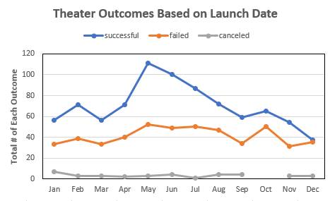

### Analysis of Outcomes Based on Goals
A new sheet was created called "Outcomes Based on Goals" with the required columns. Dollar ranges were added to the Goal column to segment the data. The =COUNTIFS() function was used to calculate the number successful, number failed, and number canceled Kickstarters by filtering on the "outcome", "goal", and "subcategory" columns as the criteria:

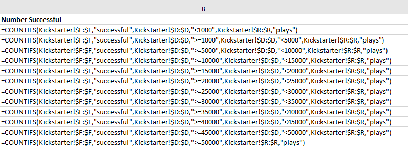

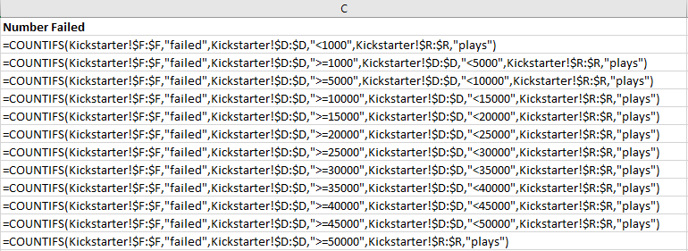

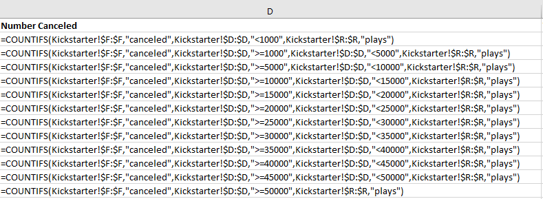

The successful, failed, and canceled outcomes were summed using =SUM() in the "Total Projects" column. Then the percentage of each was calculated by dividing the number of successful, failed, or canceled outcomes by the total number of projects:

A line chart was created to show the number of successful, failed, or canceled outcomes based on the initial Goal amount:

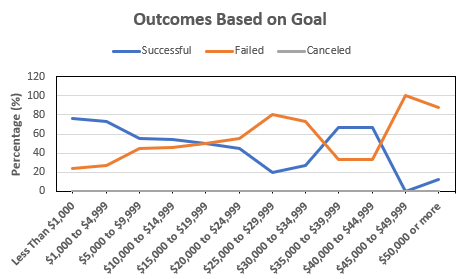

### Challenges and Difficulties Encountered
One has to be careful when setting up the conditions in the =COUNTIFS() function for Deliverable 2. I initially used the numbers from the Goal column (e.g. >= 1000 and <4999), but this left a value unaccounted for in each range of numbers - exactly 4999 in this case. I did a sanity check at the end where I did the =COUNTIFS() function for all values >0 and compared it to the sum of all of Number Successful in column B and found that they differed by 1. I changed my conditions to be more inclusive (>= 1000 and <5000), which fixed this error.

Another challenge is choosing the appropriate chart type. Line charts such as the one used in Deliverable 2 typically imply a continuous series of data, such as a data set that is a function of time. In this case, where the data is broken down into discrete buckets (like a histogram), a bar chart would be more appropriate.

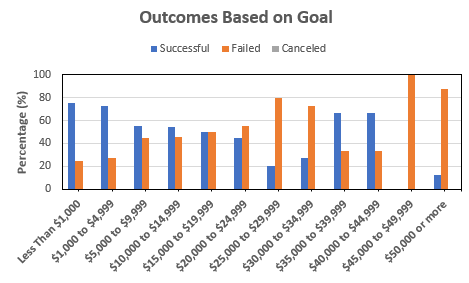

## Results

- What are two conclusions you can draw about the Outcomes based on Launch Date?

First, May is by far the best month to launch a Theater Kickstarter; the odds of success are greater than 2:1. Second, December is the worst month to start a Theater Kickstarter; the odds of success drop to roughly 50/50. December is most likely a poor month for launching Kickstarters because of the holidays. People already spend a significant amount of money on gifts and such for friends and family during this time, so they have less disposable income to contribute to a Kickstarter.

- What can you conclude about the Outcomes based on Goals?

In general, as the initial goal amount increases, the chance of success drops. Accordingly, plays that set a goal of less than $1,000 have the highest chance of success. This trend holds true until a goal of $35,000, at which point the trend briefly reverses. However, there are so few data points for each category above $35,000 that any conclusions drawn from that portion of the data may be unreliable.

- What are some limitations of this dataset?

As mentioned directly above, the size of this dataset is its main limitation. The overall dataset has more than 4,000 data points, but once you start filtering down to subcategories such as 'plays', the number of data points drops. For instance, the $45,000 to $49,999 range in the 'plays' subcategory only has one data point. With so few data points, many of the results may not be statistically significant, and thus any conclusions drawn may not be reliable. Measures of statistical significance such as confidence intervals can be added to reduce the chance of drawing incorrect conclusions.

Additionally, the data set only goes up to 2017, missing the last 5 years of data. Recent trends may have changed, so the most recent data is needed to make accurate conclusions.

- What are some other possible tables and/or graphs that we could create?

Rather than showing "successful" and "failed" categories for each plot, a ratio of sucessful to failed can be calculated to represent the odds of success. This way, the reader only has to focus on one line/trend rather than trying to make sense of how the two relate to each other. If Louise wants to quickly learn the odds of success based on launch date or goal, this is a much more intuitive metric.

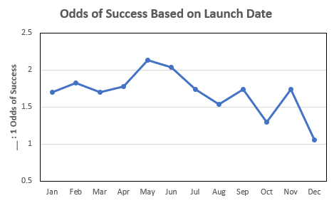

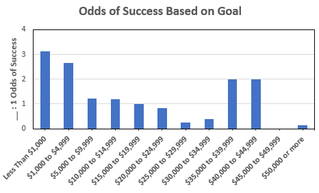

Instead of looking at successes based on launch date, one could also examine successes based on overall campaign length (subtracting date created from date ended). It would be interesting to see if longer campaigns are more likely to reach their goal.